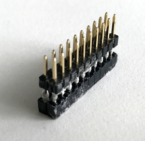

## SDI TAPAS - Community Inverter - Quick-Start Guide


Use your TAPAS board with Raspberry PI or Texas Instruments InstaSPIN

__!CAUTION!__

__The TAPAS community inverter board is not a toy!__ It is __intended for
laboratory use only. Never use it in a productive environment!__
(see section 6)

The TAPAS board can get __very hot, never touch the board during	
operation. Always use an appropriate case.__

__If the TAPAS board is used in conjunction with mechanical,
electromagnetic, acoustic, optical or other components,__ e.g. a motor
drive, __significant forces can occur. Always ensure safety of the
entire set-up! Prevent direct physical contact, always place set-up
in an appropriate case, employ safe software techniques__ (e.g. torque
limiting) and __limit the supply current.__

The device is very __sensitive to electrostatic discharge - handle with	
care! Never touch the board if the supply voltage is turned on!__

 
## Foreword and acknowledgements

This board (TAPAS) is intended to train the next generation of power 
electronics researchers and (application) engineers.
It is designed as an educational platform that addresses enthusiasts as well as experts at
universities and in the industry. 

TAPAS features a 48V, 3-phase GaN power stage with on-board filters. This
design-choice allows for a high switching frequency/bandwidth (300kHz 
and beyond) whilst producing a smooth output wave-form. In contrast, 
commonly available IGBT or MOSFET converter boards typically have a 
rather limited bandwidth and/or produce a square output wave-form.

This unique feature of high bandwidth and smooth output makes TAPAS to 
some degree universal, giving rise to educational applications in AC and DC 
drives, DC/DC power conversion, audio, robotics, magnetic field control, 
battery charging, etc. Note that universality is achieved with a single, fixed 
hardware platform where the overall functionality is defined via software 
(changes) only – the reason why we coined the term “Software Defined 
Inverter” (SDI). 

TAPAS is Raspberry PI compatible and multiple boards can be used in 
collaboration, giving rise to many-phase applications such as quadrocopters 
or multi-axis servo control. Together with open-source code examples and 
extensive documentation we made TAPAS as accessible to the community as 
possible.

To help us make TAPAS affordable, we would like to thank our friends 
and partners at Texas Instruments, Efficient Power Conversion (EPC), Würth 
Elektronik and Allegro Micro who sponsored most of the active and passive 
components on the board (see bill of materials). I hope you will have as much 
fun with TAPAS as we had making it.

Dominic Buchstaller (concept & lead-design - TAPAS)

__Created by :__


_SIEMENS SDI (Software Defined Inverter)_ \* in-house start-up for I/Os

__Components sponsored by:__


_Texas Instruments_ <http://www.ti.com>

_Efficient power conversion (EPC)_ <http://epc-co.com>

_WÜRTH ELEKTRONIK_ <http://www.we-online.com>

_Allegro Microsystems_ <http://www.allegromicro.com>

## 1. INTRODUCTION	

This quick-start-guide will lead you through the necessary steps to get TAPAS
up and running with most commercially available DC-brushless motors.
If you are new to Texas Instrument DSPs or power conversion, we advise you	
to start with this guide. It will take you through the necessary steps to set-up 
your (coding) environment and bring the board to life. You are then free to
explore the endless possibilities that the platform provides.

### TAPAS key characteristics
+ DC-Input 12V - 48V
+ Maximum DC / AC (per phase) current - 30A
+ Up to 300W continuous power - passively cooled (@>120kHz switching frequency)
+ Switching frequency up to 600 kHz at reduced load
+ On-board output-filter enables smooth output voltage
+ Texas Instruments C2000 Piccolo (TMS320F28069M) DSP - InstaSPIN-enabled
+ CAN, GPIO, UART, SPI, 2 x QEP (encoder) interface onboard
+ Raspberry-Pi compatible

### TAPAS pinout


### Box contents
+ TAPAS board
+ This quick-start guide
+ An SDI sticker
+ 7 (optional) board-connectors (JP7, JP10, JP11, JP13, JP14, SV3, SV4) for hand-soldering

### Required materials 
To get started with TAPAS you will need the following (additional) items.

+ We highly recommend placing TAPAS in __a case__. This will keep your TAPAS board safe.
The 3D model for our very own case can be found and downloaded here:
<https://github.com/SDI-SoftwareDefinedInverter/TAPAS/blob/master/TAPAShousing.zip>. 
If you don't own a 3D printer, many local 3D printing services are available on-line.
Print with temperature-stable materials like ABS (not PLA).				
+ __DC power supply__ with a minimum of 12V and >3A continuous current output.
Alternatively, you may use any battery with the correct voltage and an appropriate
fuse in the supply line	
+ A __DC brushless motor__	
+ If you want to start programming with TAPAS you will need a __JTAG programmer__.
We recommend using the OLIMEX TMS320-JTAG-USB XDS100-V2. Alternatively, you can use the newer version of this 
USB-JTAG-emulator called TMS320-XDS100v3+, there you have to leave all the jumpers open and use the __TI_JTAG_20__ 
connector to connect to your TAPAS-board with a 20pin 1:1 wired cable. 
+ If you want to use TAPAS with __Raspberry PI__ we recommend a Raspberry PI Zero (W)
+ If you want to use TAPAS with __Raspberry PI__ we also recommend the following parts for mechanical stability: 
	+ 4 screws M2,5 x 6mm (plastic)	
	+ 4 screw nuts M2,5 (plastic)
	+ 4 spacers M2,5 x 10mm with one male and one female thread (plastic)
	+ 12 washers M2,5 (plastic)

	
### Note: Difference between FIKAT (TAPAS pre-release version) and TAPAS (release version)
There are some PCB differences between the pre-release version (code-name FIKAT - PCB with Siemens & SDI logo) and release version 1.0 (code-name TAPAS - PCB with Siemens and manufacturer logos)

+ The connector of the OLIMEX JTAG programmer does not pysically fit into the JTAG-interface connector SV2 on FIKAT (it is too wide). You will have to solder a simple 1:1 adapter to make it work (see ugly example below). This has been fixed in TAPAS.  
+ TAPAS has more PINs of the Raspberry-Pi socket (SV4) connected to GND. On FIKAT only pins 34 and 39 are connected to GND. Hence 
you cannot use a Nano Pi with FIKAT as the GND connection is missing.
+ The SPI-Chip select signal (GPIO53) is connected to pin26 of SV4 via the address DIP-switch (2) on FIKAT. This has moved to pin 
16 of SV4 on TAPAS.
+ The resistor R\_MISO\_1 is populated on FIKAT but not on TAPAS. 
+ The resistors R\_TXA1, R\_RXA1, R\_TXB1 and R\_RXB1 are populated on FIKAT but not on TAPAS.
+ The 0Ohm gate resistors R19, R23, R20, R24, R12, R14, R16, R15, R17, R18, R22, R21 on FIKAT have been changed to 2,2Ohm on 
TAPAS
+ The DC-bus capacitor C10 for the 5V-voltage regulator U99 has been upgraded from a standard SMD-electrolytic type on FIKAT to a 
39µF polymer type on TAPAS. It can now handle a higher DC ripple current on the dc-bus
+ We added a TVS-clamping-diode for DC over voltage protection on TAPAS. (Not available on FIKAT). This is to absorb some of the 
breaking energy if the user forgot to use a breaking chopper
+ The isolation ICs IC5, IC6 and IC7 on FIKAT have been swapped for a different type on TAPAS  - this should have no influence on 
the behaviour
+ The current sensors on FIKAT are 20A bidirectional types, this has been changed to a 30A bidirectional type on TAPAS




## 2. GETTING STARTED WITH TAPAS AND RASPBERRY PI 
### (FOR LABORATORY USE ONLY)
+ Create an SD-Card image for your Raspberry Pi Zero (W)
(<https://www.raspberrypi.org/documentation/installation/installing-images/>)
+ Insert SD card in Raspberry PI Zero (W) and check that the Raspberry PI boots to a command prompt
+ Make sure that you have a working Python 3.0 and git installation

```
python --version
git --version
```
+ Get the TAPAS software and documentation package from 
<https://github.com/SDI-SoftwareDefinedInverter/TAPAS>
and place it into your home folder

```
cd
git clone https://github.com/SDI-SoftwareDefinedInverter/TAPAS.git
```
+ If successful, halt your Raspberry PI

```
sudo halt
```
+ Set the SPI-Address select DIP switch to (OFF)-(ON)-(OFF)-(OFF) for the switch 
positions from (1) - (4) (see pinout)
+ Disconnect the Raspberry PI from any power source and plug it into the TAPAS
Raspberry PI board connector (see pinout).
+ Connect your TAPAS board to a DC power supply and to a DC brushless motor (see pinout).
+ Set the supply voltage to 12V with 3A current limit and turn it on.
+ Log into your Raspberry PI and type

```
cd ~/TAPAS
python3 TAPASstart.py
```
+ Then follow the prompts on the monitor.

## 3. GETTING STARTED WITH TAPAS AND CODE COMPOSER STUDIO
### (FOR LABORATORY USE ONLY)
__!CAUTION!__	

__The stock TAPAS firmware implements software features that ensure safe operation.
Changing the stock TAPAS firmware may damage or destroy your TAPAS board, lead to
harm and/or danger. Make sure that you fully understand the supplied sample code and
the underlying principles before flashing your own firmware.__

For programming the TAPAS-Board, we recommend Code Composer Studio from Texas Instruments.
It is free of charge and can be downloaded from here:

<http://processors.wiki.ti.com/index.php/Download_CCS>

Choose the correct setup-package for your OS and install it following the instructions in
the installation-wizard.

The drivers for the OLIMEX JTAG-Debug probe are included in the standard installation
package. If you choose a JTAG Programmer from another vendor make sure that you installed
the correct drivers and that it is compatible with code composer studio.


To be able to use the InstaSpin capabilities of the DSP, you require motorware version
1\_01\_00\_16. Install git for your operating system and clone the repository in the same
way, you did it for the Raspberry Pi:

```
git clone https://github.com/SDI-SoftwareDefinedInverter/TAPAS.git
```


We included a copy of TI motorware in the cloned repository (_`motorware.zip`_). Alternatively you can download motorware from Motorware or here <https://github.com/SDI-SoftwareDefinedInverter/TAPAS/blob/master/motorware.zip>.

As the TAPAS board definition is not part of the stock motorware package we have to make some modifications to it. All the necessary changes are contained in the patch-file _`SDITAPASmotorwarePatch.patch`_. Now copy _`SDITAPASmotorwarePatch.patch`_ to the motorware installation folder (usually _`C:\ti\`_) and start git in bash mode (also in the motorware installation folder). Then execute the following commands:

```
dos2unix SDITAPASmotorwarePatch.patch
patch -p0 -i SDITAPASmotorwarePatch.patch
```

This completes the installation of motorware und you can start playing with the motorware-labs
and the quick-start demo firmware. To add the quick-start project, start Code Composer 
Studio and choose a workspace location. Close the welcome-window and then select 
"Project-\>Import CCS Projects..." In the upcoming window choose the option "Select search-directory"
and click the "Browse" - button. Navigate to the directory of your motorware installation,
go to the folder
_`<drive>:\ti\motorware\motorware_1_01_00_16\sw\solutions\instaspin  
_foc\boards\TAPAS_V1_0\f28x\f2806xF\projects\ccs5\`_
and click the "OK" button.

In the "Discovered projects" - list below you will see all the projects in the selected directory.
Here you can choose, for example, the _"TAPAS\_quick\_start"_ project which represents the stock demo firmware to be used with the python - script for Raspberry PI.

For all the other projects in the folders _`<drive>:\ti\motorware\motorware_1_  
01_00_16\sw\solutions\instaspin_foc\boards\TAPAS_V1_0\f28x\f2806xF\projects\ccs5\ `_
and _`<drive>:\ti\motorware\motorware_1_01_00_16\sw\solutions\instaspin_motion\  
boards\TAPAS_V1_0\f28x\f2806xF\projects\ccs5\ `_ please consider the _"InstaSPIN  
Projects and Labs User's Guide"_ which comes with the motorware-installation 
and is located in _`<drive>:\ti\motorware\motorware_1_01_00_16\docs\labs\  
instaspin_labs.pdf`_ of the motorware installation.There you can find further 
information on how to compile the firmware, start a debugging session, flash the DSP and get an
impression, what all the program components actually do. Please keep in mind that all labs are designed to drive two motors independently - this is not possible with TAPAS as there is only one 3-phase power stage.

To be able to run our TAPAS demo-webapp you also require the InstaSPIN-UNIVERSALGUI from Texas Instruments which you can get here:

<http://www.ti.com/tool/INSTASPINUNIVERSALGUI>

You have now completed the installation of the TAPAS development environment. We have also created a TAPAS-webapp to test all external I/O hardware. You can download it from:	

```
https://github.com/SDI-SoftwareDefinedInverter/TAPAS/blob/master/TAPASwebapp.zip
```
Unzip the file place it in:

```
<drive>:\ti\guicomposer\webapps\
```


## 4. FREQUENTLY ASKED QUESTIONS / TROUBLE SHOOTING

Q: Where can I get a TAPAS board 

A: For now drop a board request in the issues tracker. We will update update this section if more boards become available.


Q: Can I use other JTAG-Programmers than the OLIMEX?

A: Yes you can. As long as it's 3,3V compatible and supported by Code Composer Studio it should work.


Q: Can I run the board at full power for longer periods of time?

A: Yes you can. In that case it is important to manage the board temperature. We recommend adding some temperature monitoring code (see examples)
and dynamically limit the output current. Keep the board temperature below 90°C at all times to keep your TAPAS board healthy.


Q: If I abruptly reduce the speed of my motor why is the JTAG-connection interrupted or other funny things happen?

A: It is very likely that you are using a DC power supply and not a battery to power TAPAS. The breaking energy is fed back into the DC supply and
causes an abrupt rise in DC voltage. Note that although TAPAS is designed to absorb some breaking energy, excessive DC voltage peaks may damage the
board. To prevent this effect, limit the rate of change in motor velocity, use a battery instead of a DC power supply or invest in a current sink
(breaking chopper).

## 5. REFERENCES

The following documents can be helpful in developing with TAPAS:

+ TAPAS Pinout: 
<https://github.com/SDI-SoftwareDefinedInverter/TAPAS/blob/master/TAPAS-Pinout.pdf>	
+ TAPAS Schematics: 
<https://github.com/SDI-SoftwareDefinedInverter/TAPAS/blob/master/TAPAS-Schematic.pdf>
+ This 13document(quick start guide):
<https://github.com/SDI-SoftwareDefinedInverter/TAPAS/blob/master/TAPAS_quickStartGuide.pdf>
+ InstaSPIN-FOC and InstaSPIN-MOTION user guide : 
<http://www.ti.com/lit/ug/spruhj1g/spruhj1g.pdf>
+ Instaspin projects and labs user's guide, see motorware _`<drive>:\ti\motorware\
motorware_1_01_00_16\docs\labs\instaspin_labs.pdf`_
+ TMS320F28069MPZT overview and datasheet: 
<http://www.ti.com/lit/ug/spruh18g/spruh18g.pdf>

## 6. STANDARD TERMS FOR EVALUATION MODULES

1 Delivery: Siemens delivers TAPAS community converter boards (collectively, a “TAPAS BOARD or “TAPAS BOARDS”) to the User (“User”) free of charge in accordance with the terms set forth herein. User's acceptance of the TAPAS BOARD is expressly subject to the following terms.

1.1 TAPAS BOARDS ARE INTENDED SOLELY FOR PRODUCT OR SOFTWARE DEVELOPERS FOR USE IN A RESEARCH AND DEVELOPMENT SETTING TO FACILITATE FEASIBILITY EVALUATION, EXPERIMENTATION OR SCIENTIFIC ANALYSIS.  TAPAS BOARDS HAVE NO DIRECT FUNCTION AND ARE NOT FINISHED PRODUCTS. TAPAS BOARDS SHALL NOT BE DIRECTLY OR INDIRECTLY ASSEMBLED AS A PART OR SUBASSEMBLY IN ANY FINISHED PRODUCT. 

1.2 TAPAS BOARDS ARE NOT INTENDED FOR CONSUMER OR HOUSEHOLD USE. TAPAS BOARDS MAY NOT BE SOLD, SUBLICENSED, LEASED, RENTED, LOANED, ASSIGNED, OR OTHERWISE DISTRIBUTED FOR COMMERCIAL PURPOSES BY USERS, IN WHOLE OR IN PART, OR USED IN ANY FINISHED PRODUCT OR PRODUCTION SYSTEM.


2 Return and replacement:
Due to the fact that Siemens delivers the TAPAS BOARDS free of charge and for use in research and development settings only, Siemens will not provide any warranty with regard to any specifications of the TAPAS BOARDS. If the User notifies Siemens of any defects within thirty (30) days after delivery, Siemens will replace the respective TAPAS BOARD, provided that User returns the TAPAS BOARD within the 30-day-period to Siemens. Siemens will not provide any warranty for any replaced TAPAS BOARDS. 

3 Regulatory Notices:

3.1 European Union

3.1.1 For TAPAS BOARDs subject to EU Directive 2014/30/EU (Electromagnetic Compatibility Directive): This is a class A product intended for use in environments other than domestic environments that are connected to a low-voltage power-supply network that supplies buildings used for domestic purposes. In a domestic environment this product may cause radio interference in which case the user may be required to take adequate measures. 


4 TAPAS BOARD Use Restrictions and Warnings:

4.1 TAPAS BOARDS ARE NOT FOR USE IN FUNCTIONAL SAFETY AND/OR SAFETY CRITICAL EVALUATIONS, INCLUDING BUT NOT LIMITED TO EVALUATIONS OF LIFE SUPPORT APPLICATIONS.

4.2 User must read and follow the Quickstart Guide  provided by Siemens regarding the TAPAS BOARD prior to handling or using the TAPAS BOARD, including without limitation any warning or restriction notices. The notices contain important safety information related to, for example, temperatures and voltages.

4.3 Safety-Related Warnings and Restrictions:

4.3.1 User shall operate the TAPAS BOARD within Siemens’s recommended specifications and environmental considerations stated in the user guide, other available documentation provided by Siemens, and any other applicable requirements and employ reasonable and customary safeguards. Exceeding the specified performance ratings and specifications (including but not limited to input and output voltage, current, power, and environmental ranges) for the TAPAS BOARD may cause personal injury or death, or property damage. If there are questions concerning performance ratings and specifications, User should contact a Siemens TAPAS representative via the github issue tracker (https://github.com/SDI-SoftwareDefinedInverter/TAPAS/issues) prior to connecting interface electronics including input power and intended loads. Any loads applied outside of the specified output range may also result in unintended and/or inaccurate operation and/or possible permanent damage to the TAPAS BOARD and/or interface electronics. Please consult the TAPAS BOARD quick start guide prior to connecting any load to the TAPAS BOARD output. If there is uncertainty as to the load specification, please contact a Siemens field representative. During normal operation, even with the inputs and outputs kept within the specified allowable ranges, some circuit components may have elevated case temperatures. These components include but are not limited to linear regulators, switching transistors, pass transistors, current sense resistors, and heat sinks, which can be identified using the information in the associated documentation. When working with the TAPAS BOARD, please be aware that the TAPAS BOARD may become hot.

4.3.2 TAPAS BOARDs are intended solely for use by technically qualified, professional electronics experts who are familiar with the dangers and application risks associated with handling electrical mechanical components, systems, and subsystems. User assumes all responsibility and liability for proper and safe handling and use of the TAPAS BOARD by User or its employees, affiliates, contractors or designees. User assumes all responsibility and liability to ensure that any interfaces (electronic and/or mechanical) between the TAPAS BOARD and any human body are designed with suitable isolation and means to safely limit accessible leakage currents to minimize the risk of electrical shock hazard. User assumes all responsibility and liability for any improper or unsafe handling or use of the TAPAS BOARD by User or its employees, affiliates, contractors or designees.

4.4 User assumes all responsibility and liability to determine whether the TAPAS BOARD is subject to any applicable international, federal, state, or local laws and regulations related to User’s handling and use of the TAPAS BOARD and, if applicable, User assumes all responsibility and liability for compliance in all respects with such laws and regulations. User assumes all responsibility and liability for proper disposal and recycling of the TAPAS BOARD consistent with all applicable international, federal, state, and local requirements.

5 Accuracy of Information: To the extent Siemens provides information on the availability and function of TAPAS BOARDS, Siemens attempts to be as accurate as possible. However, Siemens does not warrant the accuracy of TAPAS BOARD descriptions, TAPAS BOARD availability or other information on its websites as accurate, complete, reliable, current, or error-free.

6 Disclaimers:

6.1 EXCEPT AS SET FORTH IN SECTION 2, SIEMENS DISCLAIMS ALL OTHER WARRANTIES, EXPRESS OR IMPLIED, REGARDING THE TAPAS BOARDS, INCLUDING BUT NOT LIMITED TO ANY WARRANTY OR IMPLIED WARRANTIES OF MERCHANTABILITY OR FITNESS FOR A PARTICULAR PURPOSE OR NON-INFRINGEMENT OF ANY THIRD PARTY PATENTS, COPYRIGHTS, TRADE SECRETS OR OTHER INTELLECTUAL PROPERTY RIGHTS.

6.2 EXCEPT FOR THE LIMITED RIGHT TO USE THE TAPAS BOARD SET FORTH HEREIN, NOTHING IN THESE TERMS SHALL BE CONSTRUED AS GRANTING OR CONFERRING ANY RIGHTS BY LICENSE, PATENT, OR ANY OTHER INDUSTRIAL OR INTELLECTUAL PROPERTY RIGHT OF SIEMENS, ITS SUPPLIERS/LICENSORS OR ANY OTHER THIRD PARTY, TO USE THE TAPAS BOARD IN ANY FINISHED END-USER OR READY-TO-USE FINAL PRODUCT, OR FOR ANY INVENTION, DISCOVERY OR IMPROVEMENT, REGARDLESS OF WHEN MADE, CONCEIVED OR ACQUIRED.

7 User's indemnity obligations and representations: USER WILL DEFEND, INDEMNIFY AND HOLD SIEMENS, ITS LICENSORS AND THEIR REPRESENTATIVES HARMLESS FROM AND AGAINST ANY AND ALL CLAIMS, DAMAGES, LOSSES, EXPENSES, COSTS AND LIABILITIES (COLLECTIVELY, "CLAIMS") ARISING OUT OF OR IN CONNECTION WITH ANY HANDLING OR USE OF THE TAPAS BOARD THAT IS NOT IN ACCORDANCE WITH THESE TERMS. THIS OBLIGATION SHALL APPLY WHETHER CLAIMS ARISE UNDER STATUTE, REGULATION, OR THE LAW OF TORT, CONTRACT OR ANY OTHER LEGAL THEORY, AND EVEN IF THE TAPAS BOARD FAILS TO PERFORM AS DESCRIBED OR EXPECTED.

8 Limitations on Damages and Liability:

8.1 General Limitations. IN NO EVENT SHALL SIEMENS BE LIABLE FOR ANY SPECIAL, , INDIRECT, , INCIDENTAL OR CONSEQUENTIAL, DAMAGES IN CONNECTION WITH OR ARISING OUT OF THESE TERMS OR THE USE OF THE TAPAS BOARDS. EXCLUDED DAMAGES INCLUDE, BUT ARE NOT LIMITED TO, COST OF REMOVAL OR REINSTALLATION, ANCILLARY COSTS TO THE PROCUREMENT OF SUBSTITUTE GOODS, RETESTING, OUTSIDE COMPUTER TIME, LABOR COSTS, LOSS OF GOODWILL, LOSS OF PROFITS, LOSS OF SAVINGS, LOSS OF USE, LOSS OF DATA, OR BUSINESS INTERRUPTION. NO CLAIM, SUIT OR ACTION SHALL BE BROUGHT AGAINST SIEMENS MORE THAN TWELVE (12) MONTHS AFTER THE EVENT THAT GAVE RISE TO THE CAUSE OF ACTION HAS OCCURRED.

8.2 Specific Limitations. IN NO EVENT SHALL SIEMENS’ AGGREGATE LIABILITY FROM ANY USE OF A TAPAS BOARD PROVIDED HEREUNDER, INCLUDING FROM ANY WARRANTY, INDEMITY OR OTHER OBLIGATION ARISING OUT OF OR IN CONNECTION WITH THESE TERMS EXCEED 1 EURO. THE EXISTENCE OF MORE THAN ONE CLAIM SHALL NOT ENLARGE OR EXTEND THIS LIMIT.

8.3 No limitation contained in this Section 8 or elsewhere in these Terms on the liability of Siemens shall apply to the extent that such liability is mandatory under the applicable law
